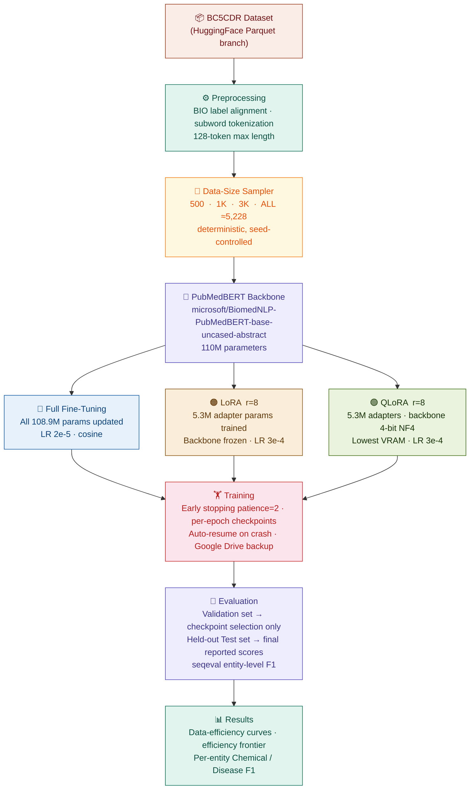

<div align="center">

# 🧬 Parameter-Efficient Fine-Tuning of PubMedBERT: Boosting Data and Memory Efficiency in Biomedical Named Entity Recognition

### *Does parameter-efficient fine-tuning beat full fine-tuning on biomedical NER — and does it win even harder with less data?*

[](https://python.org)
[](https://pytorch.org)
[](https://huggingface.co)
[](https://github.com/huggingface/peft)
[](https://github.com/TimDettmers/bitsandbytes)
[](https://github.com/chakki-works/seqeval)
[](https://colab.research.google.com/)
[](../../actions)
[](LICENSE)
[](CITATION.cff)

<br/>

| 👤 Author | 🎓 Programme | 📅 Year | 🏷️ Course |
|:---:|:---:|:---:|:---:|
| **Chigurupati Venkat Sai Kiran** | M.Tech CSE (AI & ML) | 2025–26 | 25MAI1006 |

</div>

---

## ⚡ TL;DR — Three Numbers That Tell the Story

<div align="center">

| | Full Fine-Tuning | LoRA | **QLoRA** |
|:---:|:---:|:---:|:---:|
| **Test F1** | 0.8913 | 0.8955 | **0.8964 🏆** |
| **Peak VRAM** | 2.24 GB | 0.81 GB | **0.50 GB 🏆** |
| **Trainable Params** | 108.9 M | **5.3 M** | **5.3 M** |
| **F1 at 500 samples** | 0.7098 | **0.8020 🏆** | 0.7853 |

</div>

> **Bottom line:** QLoRA matches Full fine-tuning accuracy using **4.65% of the parameters** and **4.5× less GPU memory**. LoRA beats Full FT by **9 F1 points when you only have 500 training examples** — the scenario that matters most for small clinics and rare-disease labs.

---

## 📋 Table of Contents

| | Section |
|:---:|:---|
| 💡 | [Why This Matters](#-why-this-matters) |
| 🔬 | [What Was Built](#-what-was-built--the-24-run-grid) |
| 🏗️ | [Pipeline Architecture](#️-pipeline-architecture) |
| 📊 | [Dataset](#-dataset--bc5cdr) |
| ⚙️ | [The Three Methods](#️-the-three-methods) |
| 📈 | [Full Results](#-full-results) |
| 🛡️ | [Engineering: Reliability Features](#️-engineering-reliability-features) |
| 🚀 | [Quick Start](#-quick-start) |
| 📁 | [Repository Structure](#-repository-structure) |
| 🧰 | [Tech Stack](#-tech-stack) |
| ⚠️ | [Limitations](#️-limitations) |
| 📜 | [Citation](#-citation) |

---

## 💡 Why This Matters

Full fine-tuning a 110M-parameter model like PubMedBERT on **consumer hardware (4 GB VRAM)** is barely feasible — and that's exactly the hardware available in small hospitals, university labs, and rare-disease research groups.

**Parameter-efficient fine-tuning (PEFT)** — specifically **LoRA** and **QLoRA** — promises to close this gap by freezing the backbone and training only a tiny set of adapter weights.

This project asks **two precise, answerable questions**:

> **Q1 — Accuracy/Efficiency tradeoff:** Do LoRA/QLoRA reach Full FT accuracy while using dramatically fewer parameters and less GPU memory?

> **Q2 — Data efficiency (the unique contribution):** Which method is most useful when you only have 500 or 1,000 labeled sentences — the realistic scenario for any lab that can't afford to annotate thousands of documents?

---

## 🔬 What Was Built — The 24-Run Grid

This is **not** a 3-method, 1-run demo. The core contribution is a fully reproducible **24-run controlled experiment**:

```
3 methods  ×  4 data sizes  ×  2 random seeds  =  24 training runs
  │              │                │
  │              │                └── seeds 42 & 123 → removes lucky-init noise
  │              └── 500 · 1,000 · 3,000 · ALL (5,228) → data-efficiency curve
  └── Full Fine-Tuning · LoRA · QLoRA
```

Every run produces: Test F1 · Precision · Recall · Accuracy · Peak VRAM · Training time · Trainable param count.
Results are averaged over 2 seeds before reporting.

---

## 🏗️ Pipeline Architecture



---

## 📊 Dataset — BC5CDR

**[BioCreative V Chemical-Disease Relation (BC5CDR)](https://huggingface.co/datasets/tner/bc5cdr)** — the standard benchmark for biomedical NER.

| Split | Sentences | Role in this project |
|:---|:---:|:---|
| **Train** | 5,228 | Used for training (sub-sampled to 500 / 1K / 3K / ALL) |
| **Validation** | 5,330 | Early stopping & checkpoint selection **only** |
| **Test** | 5,865 | **Final reported scores** — evaluated once, held-out |

**Entity types:** Chemical · Disease — **5 BIO labels:** `O` · `B-Chemical` · `I-Chemical` · `B-Disease` · `I-Disease`

**Example sentence:**
```
Naloxone  reverses  the  antihypertensive  effect  of  clonidine  .
B-Chem    O         O    O                 O       O   B-Chem     O
```

<details>
<summary><b>📌 Dataset loading engineering note</b></summary>

`tner/bc5cdr` uses a now-deprecated Python loading-script format. The fix: load via the auto-converted Parquet branch (`revision='refs/convert/parquet'`), which bypasses the broken script. Because this strips `ClassLabel` metadata (label IDs become plain integers with no names), BIO label names are supplied explicitly as a fallback: `['O','B-Chemical','B-Disease','I-Disease','I-Chemical']` — confirmed against the dataset's own example data.

</details>

---

## ⚙️ The Three Methods

| | Full Fine-Tuning | LoRA (r=8) | QLoRA (r=8) |
|:---|:---:|:---:|:---:|
| **Trainable params** | 108.9M | 5.3M | 5.3M |
| **% of total** | 100% | 4.65% | 4.65% |
| **Backbone during train** | Updated | Frozen (fp32) | Frozen (4-bit NF4) |
| **Peak VRAM** | ~2.24 GB | ~0.81 GB | **~0.50 GB** |
| **Avg train time** | 5.3 min | 8.9 min | 13.2 min |

**LoRA:** injects small low-rank adapter matrices (rank r=8) into the attention layers. Only the adapters and the new NER classifier head are updated. The backbone is frozen in full precision.

**QLoRA:** identical to LoRA, but the frozen backbone is first loaded in **4-bit NF4 quantization** via `bitsandbytes` before the adapters are attached. This trades a small amount of extra compute for dramatically lower memory.

<details>
<summary><b>🐛 Critical implementation bug — encountered & fixed</b></summary>

The new `classifier` head must be explicitly **excluded** from 4-bit quantization using `llm_int8_skip_modules=['classifier']` in `BitsAndBytesConfig`. Without this, the freshly-initialized (never-quantized) classifier layer causes an `AssertionError: module.weight.shape[1] == 1` crash on its very first forward pass inside `bitsandbytes`. This was a real bug encountered during development and fixed with the explicit exclusion.

</details>

---

## 📈 Full Results

### 1 · Headline — Held-out TEST Set · Full Dataset · Mean ± Std over 2 Seeds

| Rank | Method | Test F1 | Precision | Recall | Accuracy | Params | VRAM |
|:---:|:---|:---:|:---:|:---:|:---:|:---:|:---:|
| 🥇 | **QLoRA** | **0.8964** ± 0.0013 | 0.8771 | 0.9166 | 0.9782 | 5.3M | **~0.50 GB** |
| 🥈 | **LoRA** | 0.8955 ± 0.0011 | 0.8768 | 0.9150 | 0.9783 | 5.3M | ~0.81 GB |
| 🥉 | **Full FT** | 0.8913 ± 0.0040 | 0.8714 | 0.9120 | 0.9784 | 108.9M | ~2.24 GB |

> **QLoRA trains 20× fewer parameters, uses 4.5× less VRAM, and still beats Full FT by 0.5 F1 points.**

---

### 2 · Data Efficiency — Test F1 vs Training Set Size

<div align="center">

</div>

| Method | 500 samples | 1,000 samples | 3,000 samples | ALL (5,228) |
|:---|:---:|:---:|:---:|:---:|
| Full FT | 0.7098 | 0.8230 | 0.8758 | 0.8913 |
| **LoRA** | **0.8020** ⬆️ | **0.8552** ⬆️ | 0.8856 | 0.8955 |
| **QLoRA** | 0.7853 | 0.8529 | **0.8878** ⬆️ | **0.8964** ⬆️ |

> 🔑 **The headline finding:** At just **500 samples**, LoRA leads Full FT by **+9.2 F1 points** (0.8020 vs 0.7098). PEFT methods are not just more memory-efficient — they are fundamentally more **data-efficient**, which matters most precisely in the small-data settings where annotated biomedical text is scarce.

---

### 3 · All Metrics Side-by-Side (Full Dataset)

<div align="center">

</div>

---

### 4 · Efficiency Frontier — Time · Memory · Parameters

<div align="center">

</div>

> QLoRA pays a ~2.5× training-time cost vs Full FT (13.2 vs 5.3 min/run) but saves **1.74 GB VRAM** — a worthwhile tradeoff when your GPU has 4 GB total.

---

### 5 · Training Convergence — Loss Curves (Full Dataset, Both Seeds)

<div align="center">

</div>

> Both seeds converge cleanly for all three methods. The train/val gap is small (0.7–1.3 F1 points across all 6 full-data runs), confirming no overfitting to the validation set.

---

### 6 · Multi-Metric Radar

<div align="center">

</div>

> LoRA and QLoRA dominate the **Param Efficiency** axis while staying neck-and-neck on F1, Precision, and Recall.

---

### 7 · Per-Entity-Type F1 — Chemical vs. Disease

<div align="center">

</div>

| Method | Chemical F1 | Disease F1 | Gap |
|:---|:---:|:---:|:---:|
| Full FT | 0.9360 | 0.8439 | 0.0921 |
| LoRA | 0.9370 | 0.8483 | 0.0887 |
| **QLoRA** | **0.9383** | **0.8485** | **0.0898** |

> Disease NER is consistently harder (~9 F1 points lower) across all methods — driven by linguistic diversity of disease names (compound terms, abbreviations, synonyms). This is a dataset property, not a fine-tuning artifact.

---

## 🛡️ Engineering: Reliability Features

This project was designed to survive real-world interruptions (Colab disconnects, laptop sleep, power cuts) — not just run once in a clean session.

<details open>
<summary><b>Click to expand all 7 reliability features</b></summary>

| # | Feature | What it does |
|:---:|:---|:---|
| 1 | **Per-epoch checkpointing + auto-resume** | Saves a checkpoint after every epoch. Re-running the training cell resumes from the last completed checkpoint — no GPU time wasted. |
| 2 | **`DONE.json` sentinel + `all_results.pkl`** | A run is only marked done after fully finishing. The master results file re-saves after *every single run*, so a crash never loses more than one in-progress run. |
| 3 | **Google Drive auto-mount** | On Colab, auto-detects and mounts Drive so checkpoints survive session disconnects. One-time migration copies any local results to Drive. |
| 4 | **`log_history` self-healing** | Loss curves silently empty for completed runs? Fixed by reconstructing from `trainer_state.json` in each checkpoint — repairs old results without retraining. |
| 5 | **Held-out test-set backfill** | Reloads all 24 trained models from checkpoints (no retraining) and evaluates on the test set. Progress saved incrementally so a mid-backfill crash loses nothing. |
| 6 | **Dataset Parquet workaround** | `tner/bc5cdr` uses a deprecated loading script. Fix: load from `revision='refs/convert/parquet'` + explicit label name fallback. |
| 7 | **`Trainer` API compatibility** | Tries `processing_class=` (new API) then falls back to `tokenizer=` (old API) — works across all recent `transformers` versions. |

</details>

---

## 🚀 Quick Start

### ▶ Google Colab — Recommended (Free T4 GPU)

```
1. Open notebooks/PubMedBERT_BC5CDR_Capstone_Project.ipynb in Colab
2. Runtime → Change runtime type → T4 GPU
3. Run Cell 1 (installs deps) → Restart kernel
4. Run Cell 3 → approve Google Drive mount
5. Run training cell → resumes automatically if interrupted
6. Run backfill cell → computes held-out test scores for all 24 runs
7. Run figure cells → generates all plots
```

### 💻 Local Jupyter

```bash
git clone https://github.com/YOUR_USERNAME/pubmedbert-bc5cdr-peft-comparison.git
cd pubmedbert-bc5cdr-peft-comparison
pip install -r requirements.txt
jupyter notebook notebooks/PubMedBERT_BC5CDR_Capstone_Project.ipynb
```

> **Minimum hardware:** Any CUDA GPU. QLoRA fits in **0.50 GB VRAM** — feasible on almost any modern discrete GPU. Developed on RTX 3050 (4 GB VRAM).

**Estimated total runtime (24 runs, RTX 3050):** ~4–5 hours. Fully resumable across multiple sessions.

---

## 📁 Repository Structure

```
pubmedbert-bc5cdr-peft-comparison/
│
├── 📄 README.md                              ← This file
├── 📦 requirements.txt                       ← Pinned dependencies
├── 📜 LICENSE                                ← MIT
├── 📎 CITATION.cff                           ← Machine-readable citation
├── 🤝 CONTRIBUTING.md                        ← Bug reports & extension ideas
├── 🚫 .gitignore
│
├── 🤖 .github/
│   ├── ISSUE_TEMPLATE/bug_report.md          ← Structured issue form
│   └── workflows/validate.yml               ← CI: validates notebook + all files
│
├── 📓 notebooks/
│   ├── README.md                             ← Cell-by-cell guide + runtimes
│   └── PubMedBERT_BC5CDR_Capstone_Project.ipynb  ← Full pipeline, end-to-end
│
├── 🖼️ figures/
│   ├── Architecture_FINAL.svg               ← System architecture
│   ├── fig1_data_size_vs_metrics.png        ← KEY: data efficiency curves
│   ├── fig2_final_results_bar.png           ← F1/P/R/Acc bars
│   ├── fig3_efficiency.png                  ← Time · VRAM · params
│   ├── fig4_loss_curves.png                 ← Train/val loss per method
│   ├── fig5_radar.png                       ← Multi-metric radar
│   └── fig_per_entity_f1.png               ← Chemical vs Disease F1
│
└── 📊 results/
    ├── table1_results.xls                   ← Headline results (all 24 runs)
    ├── table2_efficiency.xls               ← Efficiency metrics
    └── table_per_entity_breakdown.xls      ← Per-entity F1 breakdown
```

---

## 🧰 Tech Stack

| Layer | Tools |
|:---|:---|
| **Model backbone** | `microsoft/BiomedNLP-PubMedBERT-base-uncased-abstract` |
| **Fine-tuning** | `transformers` · `peft` · `accelerate` |
| **Quantization** | `bitsandbytes` (4-bit NF4) |
| **Deep learning** | `PyTorch` |
| **Data** | `datasets` (HuggingFace) |
| **NER evaluation** | `seqeval` (entity-level span F1) |
| **Analysis** | `pandas` · `numpy` · `scikit-learn` · `scipy` |
| **Visualization** | `matplotlib` · `seaborn` |
| **Environment** | Jupyter / Google Colab |
| **Reproducibility** | Fixed seeds 42 & 123 via `transformers.set_seed()` |

---

## ⚙️ Evaluation Methodology

| Aspect | Choice | Rationale |
|:---|:---|:---|
| **Metric** | Entity-level F1 via `seqeval` | Scores whole entity spans — standard for NER |
| **Secondary metrics** | Precision · Recall · Token Accuracy | Full picture of error modes |
| **Validation set** | Early stopping + checkpoint selection **only** | Not used in any reported score |
| **Test set** | Evaluated once after training, via backfill | True held-out — no selection bias |
| **Aggregation** | Mean ± Std over 2 seeds | Removes lucky/unlucky init noise |
| **Granularity** | Per-entity Chemical + Disease breakdown | Reveals entity-specific difficulty |

---

## ⚠️ Limitations

| Limitation | Details |
|:---|:---|
| **2 seeds only** | Sufficient to show consistent trends; thin basis for strong statistical claims. Disclosed honestly rather than overclaiming. |
| **Single dataset** | BC5CDR only. Generalization to other biomedical NER corpora (NCBI Disease, BioNLP) not tested. |
| **Single base model** | PubMedBERT only. Results may differ for BioBERT, ClinicalBERT, or larger models. |
| **Default hyperparameters** | LoRA rank r=8 and learning rates were reasonable defaults, not grid-searched. |

---

## 📜 Citation

```bibtex
@misc{chigurupati2025pubmedbert,
  title     = {Data-Efficient and Resource-Aware Fine-Tuning of PubMedBERT for
               Biomedical Named Entity Recognition: A Comparative Study of
               Full Fine-Tuning, LoRA, and QLoRA on BC5CDR},
  author    = {Chigurupati, Venkat Sai Kiran},
  year      = {2025},
  note      = {M.Tech CSE (AI & ML) Capstone Project, Course 25MAI1006},
  url       = {https://github.com/YOUR_USERNAME/pubmedbert-bc5cdr-peft-comparison}
}
```

Or use the **"Cite this repository"** button on GitHub (powered by [`CITATION.cff`](CITATION.cff)).

---

## 📄 License

MIT © 2025 [Chigurupati Venkat Sai Kiran](https://github.com/YOUR_USERNAME) — see [`LICENSE`](LICENSE) for details.

---

<div align="center">

<br/>

**Chigurupati Venkat Sai Kiran**

*M.Tech CSE (Specialization in AI & ML) · Capstone 25MAI1006 · 2025–26*

<br/>

> *"The best model isn't the biggest one — it's the one that fits your constraints and still answers your question."*

<br/>

⭐ If this project helped you, please consider starring the repo

</div>
