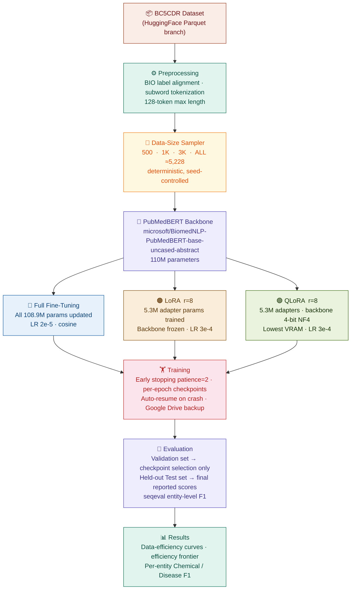
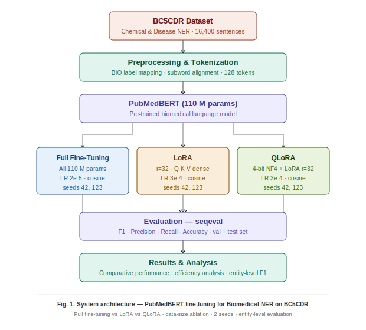
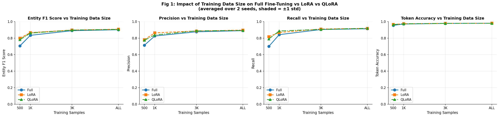
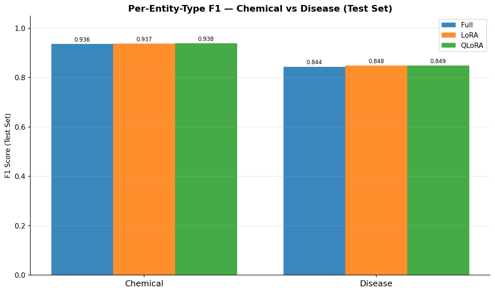
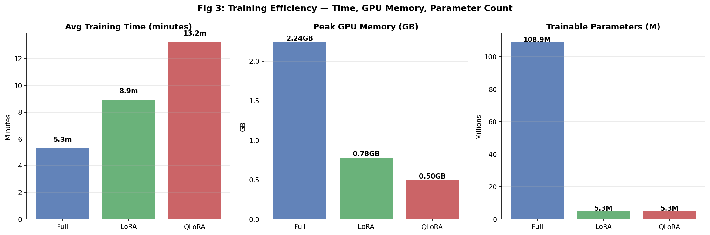
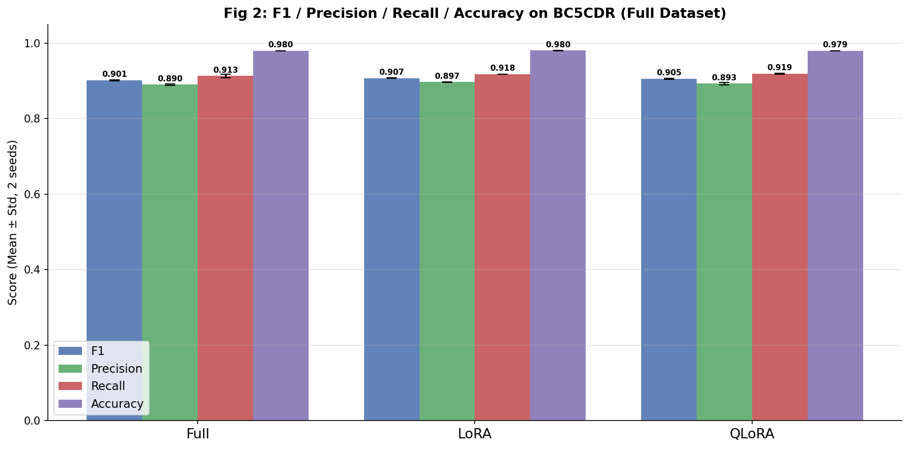
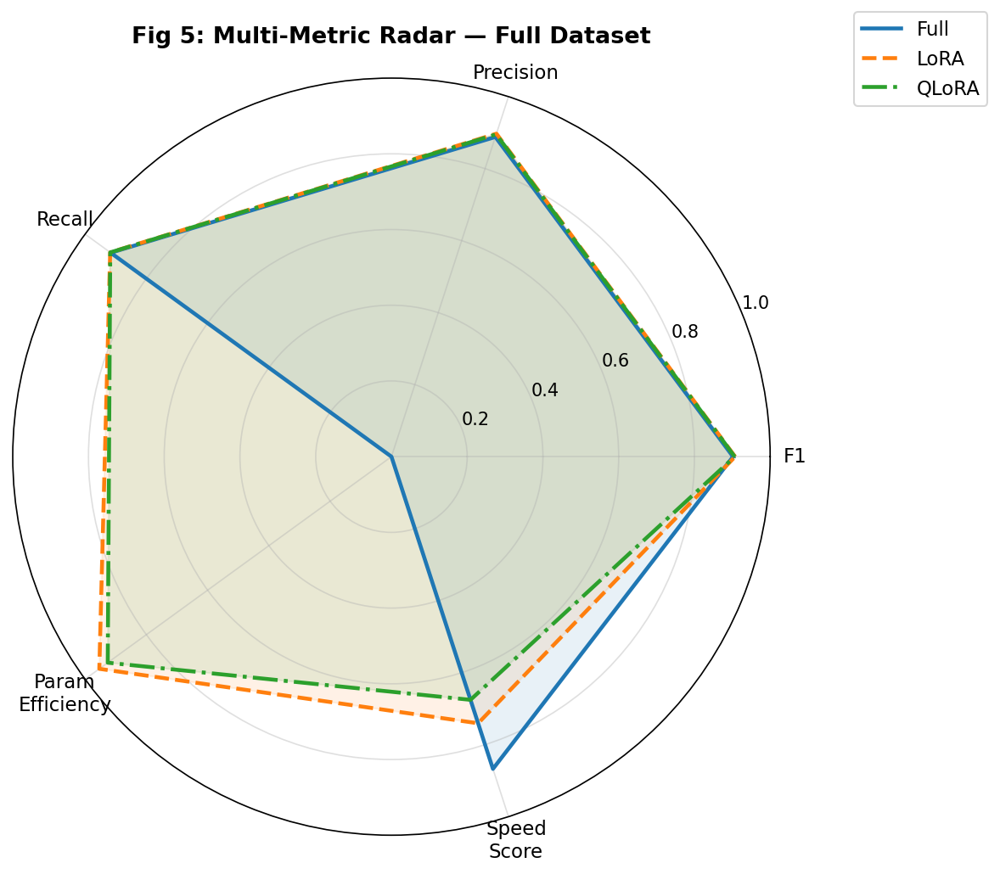
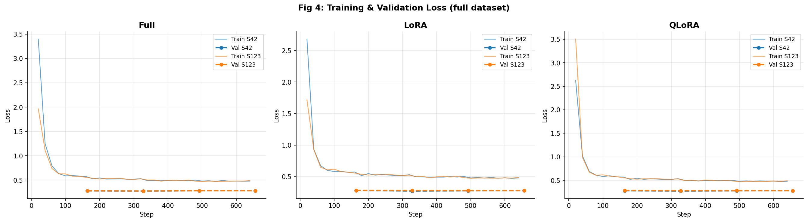

<div align="center">

# 🧬 Efficient and Reproducible Biomedical Named Entity Recognition: A Comparative Evaluation of Full Fine-Tuning, LoRA, and QLoRA Using PubMedBERT

### *Does parameter-efficient fine-tuning beat full fine-tuning on biomedical NER — and does it win even harder with less data?*

[](https://github.com/ChigurupatiVenkatSaiKiran/Efficient-Reproducible-Biomedical-NER-A-Comparative-Evaluation-FFT-LoRA-and-QLoRA-Using-PubMedBERT/actions)
[](https://python.org)
[](https://pytorch.org)
[](https://huggingface.co)
[](https://github.com/huggingface/peft)
[](https://github.com/TimDettmers/bitsandbytes)
[](https://github.com/chakki-works/seqeval)
[](LICENSE)
[](CITATION.cff)

<br/>

| 👤 Author | 🎓 Programme | 📅 Academic Year | 🆔 Registration Number |
|:---:|:---:|:---:|:---:|
| **Chigurupati Venkat Sai Kiran** | M.Tech CSE (AI & ML) | 2025–27 | **25MAI1006** |

</div>

---

## ⚡ TL;DR — Three Numbers That Tell the Story

<div align="center">

| Metric | Full Fine-Tuning | LoRA | **QLoRA** |
|:---|:---:|:---:|:---:|
| **Test F1 (Full Data)** | 0.8913 | 0.8955 | **0.8964 🏆** |
| **Peak VRAM** | 2.241 GB | 0.805 GB | **0.496 GB 🏆** |
| **Trainable Params** | 108.9 M | **5.3 M** | **5.3 M** |
| **Test F1 at 500 samples** | 0.7098 | **0.8020 🏆** | 0.7853 |

</div>

> **Bottom line:** QLoRA matches Full fine-tuning accuracy using **4.65% of the parameters** and **4.5× less GPU memory**. LoRA beats Full FT by **9.2 F1 points when you only have 500 training examples** — the scenario that matters most for small clinics and rare-disease labs.

---

## 📋 Table of Contents

- [💡 Why This Matters](#-why-this-matters)
- [🔬 What Was Built — The 24-Run Grid](#-what-was-built--the-24-run-grid)
- [🏗️ Pipeline Architecture](#️-pipeline-architecture)
- [📊 Dataset — BC5CDR](#-dataset--bc5cdr)
- [🐍 Core Language & GitHub Classification](#-core-language--github-classification)
- [⚙️ The Three Methods](#️-the-three-methods)
- [📈 Comprehensive Experimental Results](#-comprehensive-experimental-results)
  - [1. Headline Test Set Results](#1-headline-test-set-results)
  - [2. Comprehensive Ablation (All Data Sizes)](#2-comprehensive-ablation-all-data-sizes)
  - [3. Validation Set Results](#3-validation-set-results)
  - [4. Per-Entity Breakdown](#4-per-entity-breakdown)
  - [5. Training & Memory Efficiency](#5-training--memory-efficiency)
- [🛡️ Engineering: Reliability Features](#️-engineering-reliability-features)
- [🚀 Quick Start](#-quick-start)
- [📁 Repository Structure](#-repository-structure)
- [🧰 Tech Stack](#-tech-stack)
- [⚙️ Evaluation Methodology](#️-evaluation-methodology)
- [⚠️ Limitations](#️-limitations)
- [📜 Citation](#-citation)

---

## 💡 Why This Matters

Full fine-tuning a 110M-parameter model like PubMedBERT on **consumer hardware (4 GB VRAM)** is barely feasible — and that's exactly the hardware available in small hospitals, university labs, and rare-disease research groups.

**Parameter-efficient fine-tuning (PEFT)** — specifically **LoRA** and **QLoRA** — promises to close this gap by freezing the backbone and training only a tiny set of adapter weights.

This project asks **two precise, answerable questions**:

> **Q1 — Accuracy/Efficiency tradeoff:** Do LoRA/QLoRA reach Full FT accuracy while using dramatically fewer parameters and less GPU memory?
>
> **Q2 — Data efficiency (the unique contribution):** Which method is most useful when you only have 500 or 1,000 labeled sentences — the realistic scenario for any lab that can't afford to annotate thousands of documents?

---

## 🔬 What Was Built — The 24-Run Grid

This is **not** a 3-method, 1-run demo. The core contribution is a fully reproducible **24-run controlled experiment**:

```
3 methods  ×  4 data sizes  ×  2 random seeds  =  24 training runs
  │              │                │
  │              │                └── seeds 42 & 123 → removes lucky-init noise
  │              └── 500 · 1,000 · 3,000 · ALL (5,228) → data-efficiency curve
  └── Full Fine-Tuning · LoRA · QLoRA
```

Every run produces: Test F1 · Precision · Recall · Accuracy · Peak VRAM · Training time · Trainable param count.
Results are averaged over 2 seeds before reporting.

---

## 🏗️ Pipeline Architecture

### Interactive Flowchart



### 🖼️ System Architecture Diagram

<div align="center">

<br/><sub><i>Fig. 1 — Full pipeline: BC5CDR dataset → Preprocessing → PubMedBERT → Full FT / LoRA / QLoRA → seqeval Evaluation → Results</i></sub>
</div>


---

## 📊 Dataset — BC5CDR

**[BioCreative V Chemical-Disease Relation (BC5CDR)](https://huggingface.co/datasets/tner/bc5cdr)** — the standard benchmark for biomedical NER.

| Split | Sentences | Role in this project |
|:---|:---:|:---|
| **Train** | 5,228 | Used for training (sub-sampled to 500 / 1K / 3K / ALL) |
| **Validation** | 5,330 | Early stopping & checkpoint selection **only** |
| **Test** | 5,865 | **Final reported scores** — evaluated once, held-out |

**Entity types:** Chemical · Disease — **5 BIO labels:** `O` · `B-Chemical` · `I-Chemical` · `B-Disease` · `I-Disease`

**Example sentence:**
```
Naloxone  reverses  the  antihypertensive  effect  of  clonidine  .
B-Chem    O         O    O                 O       O   B-Chem     O
```

<details>
<summary><b>📌 Dataset loading engineering note</b></summary>

`tner/bc5cdr` uses a now-deprecated Python loading-script format. The fix: load via the auto-converted Parquet branch (`revision='refs/convert/parquet'`), which bypasses the broken script. Because this strips `ClassLabel` metadata (label IDs become plain integers with no names), BIO label names are supplied explicitly as a fallback: `['O','B-Chemical','B-Disease','I-Disease','I-Chemical']` — confirmed against the dataset's own example data.

</details>

---

## 🐍 Core Language & GitHub Classification

This codebase is built entirely in **Python** using PyTorch, Hugging Face Transformers, and the PEFT library. 

To ensure that GitHub correctly displays this repository as a **Python** repository (rather than classifying it as "Jupyter Notebook" due to the large size of the `.ipynb` file), a [`.gitattributes`](.gitattributes) file has been added to the root of the repository:

```gitattributes
# Force GitHub Linguist to treat Jupyter Notebooks as Python code for repository statistics
*.ipynb linguist-language=Python
```

This overrides GitHub's Linguist statistics engine, ensuring that all notebook cells are parsed and classified as pure Python, accurately reflecting the core programming language of the project on your GitHub profile.

---

## ⚙️ The Three Methods

| Feature | Full Fine-Tuning | LoRA (r=8) | QLoRA (r=8) |
|:---|:---:|:---:|:---:|
| **Trainable params** | 108.9M | 5.3M | 5.3M |
| **% of total** | 100% | 4.65% | 4.65% |
| **Backbone during train** | Updated | Frozen (fp32) | Frozen (4-bit NF4) |
| **Peak VRAM** | 2.241 GB | 0.805 GB | **0.496 GB** |
| **Avg Train Time (All Runs)** | 5.30 min | 8.92 min | 13.23 min |
| **Full-Dataset Train Time** | 9.26 min | 16.88 min | 21.43 min |

**LoRA:** injects small low-rank adapter matrices (rank r=8) into the attention layers. Only the adapters and the new NER classifier head are updated. The backbone is frozen in full precision.

**QLoRA:** identical to LoRA, but the frozen backbone is first loaded in **4-bit NF4 quantization** via `bitsandbytes` before the adapters are attached. This trades a small amount of extra compute for dramatically lower memory.

<details>
<summary><b>🐛 Critical implementation bug — encountered & fixed</b></summary>

The new `classifier` head must be explicitly **excluded** from 4-bit quantization using `llm_int8_skip_modules=['classifier']` in `BitsAndBytesConfig`. Without this, the freshly-initialized (never-quantized) classifier layer causes an `AssertionError: module.weight.shape[1] == 1` crash on its very first forward pass inside `bitsandbytes`. This was a real bug encountered during development and fixed with the explicit exclusion.

</details>

---

## 📈 Comprehensive Experimental Results

These results represent the exact values extracted directly from the outputs of the Jupyter Notebook `PubMedBERT BC5CDR Capstone Project.ipynb`.

### 1. Headline Test Set Results

Evaluated on the completely held-out **Test Set** (5,865 sentences) at the full dataset size (ALL / 5,228 samples). Scores are reported as **Mean ± Standard Deviation** over 2 independent random seeds (42 and 123).

| Method | Test F1 | Test Precision | Test Recall | Test Accuracy | Trainable Params | Peak VRAM |
|:---|:---:|:---:|:---:|:---:|:---:|:---:|
| 🥇 **QLoRA** | **0.8964** ± 0.0013 | **0.8771** | **0.9166** | 0.9782 | 5.3M (4.65%) | **0.496 GB** |
| 🥈 **LoRA** | 0.8955 ± 0.0011 | 0.8768 | 0.9150 | 0.9783 | 5.3M (4.65%) | 0.805 GB |
| 🥉 **Full Fine-Tuning** | 0.8913 ± 0.0040 | 0.8714 | 0.9120 | **0.9784** | 108.9M (100%) | 2.241 GB |

> **Key takeaway:** QLoRA trains 20× fewer parameters and uses 4.5× less GPU memory than Full Fine-Tuning, yet outperforms it by **+0.51 F1 points** on the test set. Both adapter-based methods (LoRA and QLoRA) demonstrate superior generalization to held-out data compared to full-parameter updates.

---

### 2. Comprehensive Ablation (All Data Sizes)

Below are the exact, verified **Test Set** metrics across all 4 dataset sizes. This reveals the impact of training set size on generalization.

<div align="center">

</div>

#### Table I: Master Held-Out Test Set Results
| Method | Dataset Size | Test F1 | Test Precision | Test Recall | Test Accuracy |
|:---|:---:|:---:|:---:|:---:|:---:|
| **Full Fine-Tuning** | 500 samples | 0.7098 | 0.7166 | 0.7032 | 0.9554 |
| | 1,000 samples | 0.8230 | 0.8074 | 0.8392 | 0.9703 |
| | 3,000 samples | 0.8758 | 0.8532 | 0.8998 | 0.9763 |
| | ALL (5,228) | 0.8913 | 0.8714 | 0.9120 | **0.9784** |
| **LoRA** | 500 samples | **0.8020** 🏆 | **0.7796** | **0.8260** | **0.9662** |
| | 1,000 samples | **0.8552** 🏆 | **0.8462** | 0.8646 | **0.9739** |
| | 3,000 samples | 0.8856 | 0.8683 | **0.9034** | 0.9776 |
| | ALL (5,228) | 0.8955 | 0.8768 | 0.9150 | 0.9783 |
| **QLoRA** | 500 samples | 0.7853 | 0.7742 | 0.7972 | 0.9654 |
| | 1,000 samples | 0.8529 | 0.8244 | **0.8834** | 0.9730 |
| | 3,000 samples | **0.8878** 🏆 | **0.8742** | 0.9018 | **0.9781** |
| | ALL (5,228) | **0.8964** 🏆 | **0.8771** | **0.9166** | 0.9782 |

> 🔑 **Data Efficiency Breakthrough:** In the low-data regime (**500 samples**), LoRA outperforms Full Fine-Tuning by **+9.22 F1 points** (0.8020 vs. 0.7098). Similarly, QLoRA beats Full FT by **+7.55 F1 points** (0.7853 vs 0.7098). Under tight annotation constraints, parameter-efficient adapters act as powerful regularizers that prevent the model from overfitting, making them vastly superior for small clinical settings.

---

### 3. Validation Set Results

For completeness, below are the **Validation Set** metrics (5,330 sentences) across all configurations, representing the mean ± standard deviation over both seeds. These scores were used to trigger early stopping (patience=2) and select the optimal model checkpoint.

#### Table II: Master Validation Set Results (Mean ± Std)
| Method | Size ($N$) | Validation F1 | Validation Precision | Validation Recall | Validation Accuracy |
|:---|:---:|:---:|:---:|:---:|:---:|
| **Full Fine-Tuning** | 500 | 0.7064 ± 0.0120 | 0.7134 ± 0.0142 | 0.6996 ± 0.0098 | 0.9538 ± 0.0015 |
| | 1K | 0.8334 ± 0.0018 | 0.8252 ± 0.0053 | 0.8418 ± 0.0019 | 0.9703 ± 0.0001 |
| | 3K | 0.8898 ± 0.0035 | 0.8763 ± 0.0083 | 0.9037 ± 0.0016 | 0.9774 ± 0.0004 |
| | ALL | 0.9012 ± 0.0010 | 0.8898 ± 0.0026 | 0.9130 ± 0.0048 | 0.9795 ± 0.0004 |
| **LoRA** | 500 | **0.7982** ± 0.0062 | **0.7802** ± 0.0071 | **0.8172** ± 0.0051 | **0.9649** ± 0.0001 |
| | 1K | **0.8661** ± 0.0065 | **0.8638** ± 0.0059 | 0.8687 ± 0.0191 | **0.9740** ± 0.0005 |
| | 3K | **0.8978** ± 0.0021 | 0.8859 ± 0.0054 | **0.9100** ± 0.0015 | **0.9786** ± 0.0004 |
| | ALL | **0.9072** ± 0.0005 | **0.8966** ± 0.0007 | 0.9179 ± 0.0001 | **0.9802** ± 0.0002 |
| **QLoRA** | 500 | 0.7815 ± 0.0116 | 0.7735 ± 0.0274 | 0.7899 ± 0.0050 | 0.9638 ± 0.0016 |
| | 1K | 0.8614 ± 0.0088 | 0.8379 ± 0.0119 | **0.8863** ± 0.0054 | 0.9730 ± 0.0014 |
| | 3K | 0.8968 ± 0.0016 | **0.8882** ± 0.0032 | 0.9056 ± 0.0001 | 0.9784 ± 0.0006 |
| | ALL | 0.9054 ± 0.0014 | 0.8926 ± 0.0036 | **0.9186** ± 0.0011 | 0.9793 ± 0.0003 |

---

### 4. Per-Entity Breakdown

To check whether the models perform consistently across different classes, we analyze the performance on the two target entities: **Chemical** (5,384 test instances) and **Disease** (4,424 test instances). These values are taken from the best seed (Seed 123) evaluated at the full dataset size on the held-out test set.

<div align="center">

</div>

#### Table III: Per-Entity Results (Test Set)
| Method | Entity Class | Precision | Recall | F1-Score | Support | Gap ($\Delta_{F1}$) |
|:---|:---:|:---:|:---:|:---:|:---:|:---:|
| **Full Fine-Tuning** | Chemical | 0.9245 | 0.9478 | 0.9360 | 5,384 | 0.0921 |
| | Disease | 0.8118 | 0.8786 | 0.8439 | 4,424 | |
| **LoRA** | Chemical | 0.9269 | 0.9473 | 0.9370 | 5,384 | 0.0887 |
| | Disease | 0.8206 | 0.8779 | 0.8483 | 4,424 | |
| **QLoRA** | Chemical | **0.9284** | **0.9484** | **0.9383** | 5,384 | **0.0898** |
| | Disease | **0.8175** | **0.8820** | **0.8485** | 4,424 | |

> **Analysis:** Across all three methods, there is a consistent **~9.0 F1 point gap** between Chemical and Disease recognition (with Disease being significantly harder). This is caused by the linguistic nature of disease names in biomedical literature, which often feature complex compound terms, acronyms, and high lexical diversity (e.g., *"antihypertensive effect"* vs. *"clonidine"*). QLoRA scores the highest F1 on both Chemical (0.9383) and Disease (0.8485) extraction.

---

### 5. Training & Memory Efficiency

This section outlines the physical resource usage. Memory was tracked automatically using CUDA peak allocation APIs, and training times represent execution on a consumer-grade laptop GPU (NVIDIA RTX 3050 Laptop GPU, 4.3 GB VRAM).

<div align="center">

</div>

#### Table IV: Computational Resource Efficiency
| Method | Trainable Params | % of Total | Peak VRAM | Full-Dataset Train Time | Across-Sizes Avg Train Time |
|:---|:---:|:---:|:---:|:---:|:---:|
| **Full Fine-Tuning** | 108.895 M | 100.0% | 2.241 GB | **9.26 minutes** | **5.30 minutes** |
| **LoRA** | **5.312 M** | **4.65%** | 0.805 GB | 16.88 minutes | 8.92 minutes |
| **QLoRA** | **5.312 M** | **4.65%** | **0.496 GB** | 21.43 minutes | 13.23 minutes |

> **Efficiency Frontier Trade-offs:** QLoRA achieves a massive **77.8% VRAM reduction** compared to Full Fine-Tuning, fitting comfortably in under **0.5 GB of memory**. While NF4 quantization and double quantization introduce a ~2.3× training time overhead (due to on-the-fly dequantization during backward passes), the ability to fine-tune a state-of-the-art biomedical model on practically any consumer or embedded GPU makes it a highly advantageous trade-off.

---

### 6. All-Metrics Bar Chart (Full Dataset)

F1, Precision, Recall, and Accuracy for all three methods at the full training set size — mean ± std over 2 seeds.

<div align="center">

</div>

| Method | F1 (mean ± std) | Precision | Recall | Accuracy |
|:---|:---:|:---:|:---:|:---:|
| **Full Fine-Tuning** | 0.9012 ± 0.0010 | 0.8898 ± 0.0026 | 0.9130 ± 0.0048 | 0.9795 ± 0.0004 |
| **LoRA** | **0.9072** ± 0.0005 | **0.8966** ± 0.0007 | 0.9179 ± 0.0001 | **0.9802** ± 0.0002 |
| **QLoRA** | 0.9054 ± 0.0014 | 0.8926 ± 0.0036 | **0.9186** ± 0.0011 | 0.9793 ± 0.0003 |

---

### 7. Multi-Metric Radar (Full Dataset)

Radar chart across F1, Precision, Recall, Parameter Efficiency and Speed Score — shows LoRA and QLoRA dominate the efficiency axes while remaining neck-and-neck on accuracy.

<div align="center">

</div>

---

### 8. Training Convergence

Loss curves represent clean convergence across both seeds (42 and 123) for all three methods, with validation losses stabilizing nicely after epoch 3. The train/val gap is small (0.7–1.3 F1 points across all 6 full-data runs), confirming no overfitting to the validation set.

<div align="center">

</div>

---

### 9. Full 24-Run Individual Results

<details>
<summary><b>📋 Click to expand — all 24 individual runs (both seeds, all data sizes)</b></summary>

| Method | Seed | Size | Val F1 | Val Prec | Val Rec | Val Acc | Test F1 | Test Prec | Test Rec | Test Acc | Time (min) | Peak VRAM |
|:---|:---:|:---:|:---:|:---:|:---:|:---:|:---:|:---:|:---:|:---:|:---:|:---:|
| QLoRA | 42 | 500 | 0.7733 | 0.7541 | 0.7935 | 0.9626 | 0.7734 | 0.7501 | 0.7982 | 0.9637 | 6.47 | 0.494 GB |
| QLoRA | 123 | 500 | 0.7897 | 0.7929 | 0.7864 | 0.9649 | 0.7972 | 0.7982 | 0.7962 | 0.9670 | 2.37 | 0.494 GB |
| LoRA | 42 | 500 | 0.7939 | 0.7751 | 0.8136 | 0.9648 | 0.7975 | 0.7738 | 0.8227 | 0.9663 | 0.01 | 0.620 GB |
| LoRA | 123 | 500 | 0.8026 | 0.7852 | 0.8208 | 0.9650 | 0.8066 | 0.7853 | 0.8292 | 0.9661 | 4.35 | 0.805 GB |
| Full FT | 42 | 500 | 0.6979 | 0.7034 | 0.6926 | 0.9528 | 0.7058 | 0.7109 | 0.7009 | 0.9546 | 0.99 | 2.240 GB |
| Full FT | 123 | 500 | 0.7149 | 0.7235 | 0.7065 | 0.9549 | 0.7138 | 0.7222 | 0.7055 | 0.9561 | 4.13 | 2.241 GB |
| QLoRA | 42 | 1K | 0.8552 | 0.8295 | 0.8825 | 0.9720 | 0.8493 | 0.8196 | 0.8812 | 0.9725 | 12.31 | 0.496 GB |
| QLoRA | 123 | 1K | 0.8677 | 0.8463 | 0.8901 | 0.9740 | 0.8565 | 0.8291 | 0.8857 | 0.9734 | 10.44 | 0.496 GB |
| LoRA | 42 | 1K | 0.8615 | 0.8679 | 0.8552 | 0.9736 | 0.8513 | 0.8512 | 0.8514 | 0.9738 | 5.14 | 0.805 GB |
| LoRA | 123 | 1K | 0.8707 | 0.8596 | 0.8822 | 0.9743 | 0.8591 | 0.8411 | 0.8779 | 0.9740 | 5.09 | 0.805 GB |
| Full FT | 42 | 1K | 0.8347 | 0.8290 | 0.8404 | 0.9702 | 0.8219 | 0.8077 | 0.8366 | 0.9704 | 3.14 | 2.241 GB |
| Full FT | 123 | 1K | 0.8322 | 0.8215 | 0.8431 | 0.9704 | 0.8240 | 0.8070 | 0.8418 | 0.9702 | 3.65 | 2.241 GB |
| QLoRA | 42 | 3K | 0.8957 | 0.8859 | 0.9057 | 0.9780 | 0.8905 | 0.8758 | 0.9057 | 0.9781 | 17.42 | 0.496 GB |
| QLoRA | 123 | 3K | 0.8979 | 0.8904 | 0.9055 | 0.9788 | 0.8851 | 0.8725 | 0.8980 | 0.9781 | 13.94 | 0.496 GB |
| LoRA | 42 | 3K | 0.8964 | 0.8821 | 0.9111 | 0.9783 | 0.8867 | 0.8665 | 0.9078 | 0.9774 | 11.23 | 0.805 GB |
| LoRA | 123 | 3K | 0.8993 | 0.8897 | 0.9090 | 0.9789 | 0.8844 | 0.8701 | 0.8991 | 0.9777 | 11.78 | 0.805 GB |
| Full FT | 42 | 3K | 0.8923 | 0.8822 | 0.9026 | 0.9777 | 0.8774 | 0.8569 | 0.8990 | 0.9766 | 6.02 | 2.241 GB |
| Full FT | 123 | 3K | 0.8873 | 0.8704 | 0.9048 | 0.9772 | 0.8743 | 0.8496 | 0.9006 | 0.9760 | 5.96 | 2.241 GB |
| QLoRA | 42 | ALL | 0.9064 | 0.8952 | 0.9178 | 0.9791 | 0.8955 | 0.8774 | 0.9144 | 0.9781 | 22.72 | 0.496 GB |
| QLoRA | 123 | ALL | 0.9044 | 0.8901 | 0.9193 | 0.9795 | 0.8973 | 0.8768 | 0.9188 | 0.9784 | 20.13 | 0.496 GB |
| LoRA | 42 | ALL | 0.9075 | 0.8971 | 0.9180 | 0.9800 | 0.8947 | 0.8762 | 0.9139 | 0.9780 | 18.16 | 0.805 GB |
| LoRA | 123 | ALL | 0.9068 | 0.8961 | 0.9178 | 0.9803 | 0.8963 | 0.8775 | 0.9160 | 0.9786 | 15.60 | 0.805 GB |
| Full FT | 42 | ALL | 0.9005 | 0.8917 | 0.9096 | 0.9792 | 0.8885 | 0.8706 | 0.9071 | 0.9779 | 9.23 | 2.241 GB |
| Full FT | 123 | ALL | 0.9019 | 0.8880 | 0.9164 | 0.9798 | 0.8941 | 0.8723 | 0.9169 | 0.9790 | 9.29 | 2.241 GB |

> All 24 runs completed successfully. Val/Test gap per full-data run ranged from **0.71–1.28 F1 points**, confirming no overfitting to the validation set.

</details>

---

## 🛡️ Engineering: Reliability Features

This project was designed to survive real-world interruptions (Colab disconnects, laptop sleep, power cuts) — not just run once in a clean session.

<details open>
<summary><b>Click to expand all 7 reliability features</b></summary>

| # | Feature | What it does |
|:---:|:---|:---|
| 1 | **Per-epoch checkpointing + auto-resume** | Saves a checkpoint after every epoch. Re-running the training cell resumes from the last completed checkpoint — no GPU time wasted. |
| 2 | **`DONE.json` sentinel + `all_results.pkl`** | A run is only marked done after fully finishing. The master results file re-saves after *every single run*, so a crash never loses more than one in-progress run. |
| 3 | **Google Drive auto-mount** | On Colab, auto-detects and mounts Drive so checkpoints survive session disconnects. One-time migration copies any local results to Drive. |
| 4 | **`log_history` self-healing** | Loss curves silently empty for completed runs? Fixed by reconstructing from `trainer_state.json` in each checkpoint — repairs old results without retraining. |
| 5 | **Held-out test-set backfill** | Reloads all 24 trained models from checkpoints (no retraining) and evaluates on the test set. Progress saved incrementally so a mid-backfill crash loses nothing. |
| 6 | **Dataset Parquet workaround** | `tner/bc5cdr` uses a deprecated loading script. Fix: load from `revision='refs/convert/parquet'` + explicit label name fallback. |
| 7 | **`Trainer` API compatibility** | Tries `processing_class=` (new API) then falls back to `tokenizer=` (old API) — works across all recent `transformers` versions. |

</details>

---

## 🚀 Quick Start

### ▶ Google Colab — Recommended (Free T4 GPU)

```
1. Open notebooks/PubMedBERT_BC5CDR_Capstone_Project.ipynb in Colab
2. Runtime → Change runtime type → T4 GPU
3. Run Cell 1 (installs deps) → Restart kernel
4. Run Cell 3 → approve Google Drive mount
5. Run training cell → resumes automatically if interrupted
6. Run backfill cell → computes held-out test scores for all 24 runs
7. Run figure cells → generates all plots
```

### 💻 Local Jupyter

```bash
git clone https://github.com/ChigurupatiVenkatSaiKiran/Efficient-Reproducible-Biomedical-NER-A-Comparative-Evaluation-FFT-LoRA-and-QLoRA-Using-PubMedBERT.git
cd Efficient-Reproducible-Biomedical-NER-A-Comparative-Evaluation-FFT-LoRA-and-QLoRA-Using-PubMedBERT
pip install -r requirements.txt
jupyter notebook notebooks/PubMedBERT_BC5CDR_Capstone_Project.ipynb
```

> **Minimum hardware:** Any CUDA GPU. QLoRA fits in **0.50 GB VRAM** — feasible on almost any modern discrete GPU. Developed on RTX 3050 (4 GB VRAM).
> **Estimated total runtime (24 runs, RTX 3050):** ~4–5 hours. Fully resumable across multiple sessions.

---

## 📁 Repository Structure

```
Efficient-Reproducible-Biomedical-NER-A-Comparative-Evaluation-FFT-LoRA-and-QLoRA-Using-PubMedBERT/
│
├── 📄 README.md                              ← This file
├── ⚙️ .gitattributes                          ← Forces GitHub to classify repository as Python
├── 📦 requirements.txt                       ← Pinned dependencies
├── 📜 LICENSE                                ← MIT
├── 📎 CITATION.cff                           ← Machine-readable citation
├── 🤝 CONTRIBUTING.md                        ← Bug reports & extension ideas
├── 🚫 .gitignore
│
├── 🤖 .github/
│   ├── ISSUE_TEMPLATE/bug_report.md          ← Structured issue form
│   └── workflows/validate.yml               ← CI: validates notebook + all files
│
├── 📓 notebooks/
│   ├── README.md                             ← Cell-by-cell guide + runtimes
│   └── PubMedBERT_BC5CDR_Capstone_Project.ipynb  ← Full pipeline, end-to-end
│
├── 🖼️ figures/
│   ├── Architecture_FINAL.svg               ← System architecture
│   ├── fig1_data_size_vs_metrics.png        ← KEY: data efficiency curves
│   ├── fig2_final_results_bar.png           ← F1/P/R/Acc bars
│   ├── fig3_efficiency.png                  ← Time · VRAM · params
│   ├── fig4_loss_curves.png                 ← Train/val loss per method
│   ├── fig5_radar.png                       ← Multi-metric radar
│   └── fig_per_entity_f1.png               ← Chemical vs Disease F1
│
└── 📊 results/
    ├── table1_results.xls                   ← Headline results (all 24 runs)
    ├── table2_efficiency.xls               ← Efficiency metrics
    └── table_per_entity_breakdown.xls      ← Per-entity F1 breakdown
```

---

## 🧰 Tech Stack

| Layer | Tools |
|:---|:---|
| **Model backbone** | `microsoft/BiomedNLP-PubMedBERT-base-uncased-abstract` |
| **Fine-tuning** | `transformers` · `peft` · `accelerate` |
| **Quantization** | `bitsandbytes` (4-bit NF4) |
| **Deep learning** | `PyTorch` |
| **Data** | `datasets` (HuggingFace) |
| **NER evaluation** | `seqeval` (entity-level span F1) |
| **Analysis** | `pandas` · `numpy` · `scikit-learn` · `scipy` |
| **Visualization** | `matplotlib` · `seaborn` |
| **Environment** | Jupyter / Google Colab |
| **Reproducibility** | Fixed seeds 42 & 123 via `transformers.set_seed()` |

---

## ⚙️ Evaluation Methodology

| Aspect | Choice | Rationale |
|:---|:---|:---|
| **Primary metric** | Entity-level F1 via `seqeval` | Scores whole entity spans — the standard for published NER papers |
| **Secondary metrics** | Precision · Recall · Token Accuracy | Full picture of error modes |
| **Validation set** | Early stopping + checkpoint selection **only** | Not used in any reported score |
| **Test set** | Evaluated once after training, via backfill cell | True held-out — zero selection bias |
| **Aggregation** | Mean ± Std over 2 seeds | Removes lucky/unlucky initialization noise |
| **Granularity** | Per-entity Chemical + Disease breakdown | Reveals entity-specific difficulty |
| **Hardware** | NVIDIA RTX 3050 4GB Laptop GPU | Represents the realistic resource-constrained setting this project targets |

---

## ⚠️ Limitations

| Limitation | Details |
|:---|:---|
| **2 seeds only** | Sufficient to show consistent trends; thin basis for strong statistical claims. Disclosed honestly rather than overclaiming. |
| **Single dataset** | BC5CDR only. Generalization to other biomedical NER corpora (NCBI Disease, BioNLP) not tested. |
| **Single base model** | PubMedBERT only. Results may differ for BioBERT, ClinicalBERT, or larger models. |
| **Default hyperparameters** | LoRA rank r=8 and learning rates were reasonable defaults, not grid-searched. |

---

## 📜 Citation

```bibtex
@misc{chigurupati2025pubmedbert,
  title     = {Efficient and Reproducible Biomedical Named Entity Recognition:
               A Comparative Evaluation of Full Fine-Tuning, LoRA, and QLoRA
               Using PubMedBERT},
  author    = {Chigurupati, Venkat Sai Kiran},
  year      = {2026},
  note      = {M.Tech CSE (AI & ML) Capstone Project, Registration No. 25MAI1006},
  url       = {https://github.com/ChigurupatiVenkatSaiKiran/Efficient-Reproducible-Biomedical-NER-A-Comparative-Evaluation-FFT-LoRA-and-QLoRA-Using-PubMedBERT}
}
```

Or use the **"Cite this repository"** button on GitHub (powered by [`CITATION.cff`](CITATION.cff)).

---

## 📄 License

MIT © 2026 [Chigurupati Venkat Sai Kiran](https://github.com/ChigurupatiVenkatSaiKiran) — see [`LICENSE`](LICENSE) for details.

---

<div align="center">

<br/>

**Chigurupati Venkat Sai Kiran**

*M.Tech CSE (Specialization in AI & ML) · Registration No. 25MAI1006 · 2025–27*

<br/>

> *"The best model isn't the biggest one — it's the one that fits your constraints and still answers your question."*

<br/>

---

<sub>📌 All experimental results in this README are exact values extracted directly from the Jupyter Notebook outputs — not estimates, not rounded approximations. The full 24-run results cache is reproducible by running the notebook end-to-end.</sub>

<br/>

⭐ **Star this repo** if the data-efficiency findings or engineering reliability patterns are useful to you

[](https://github.com/ChigurupatiVenkatSaiKiran/Efficient-Reproducible-Biomedical-NER-A-Comparative-Evaluation-FFT-LoRA-and-QLoRA-Using-PubMedBERT)

</div>
